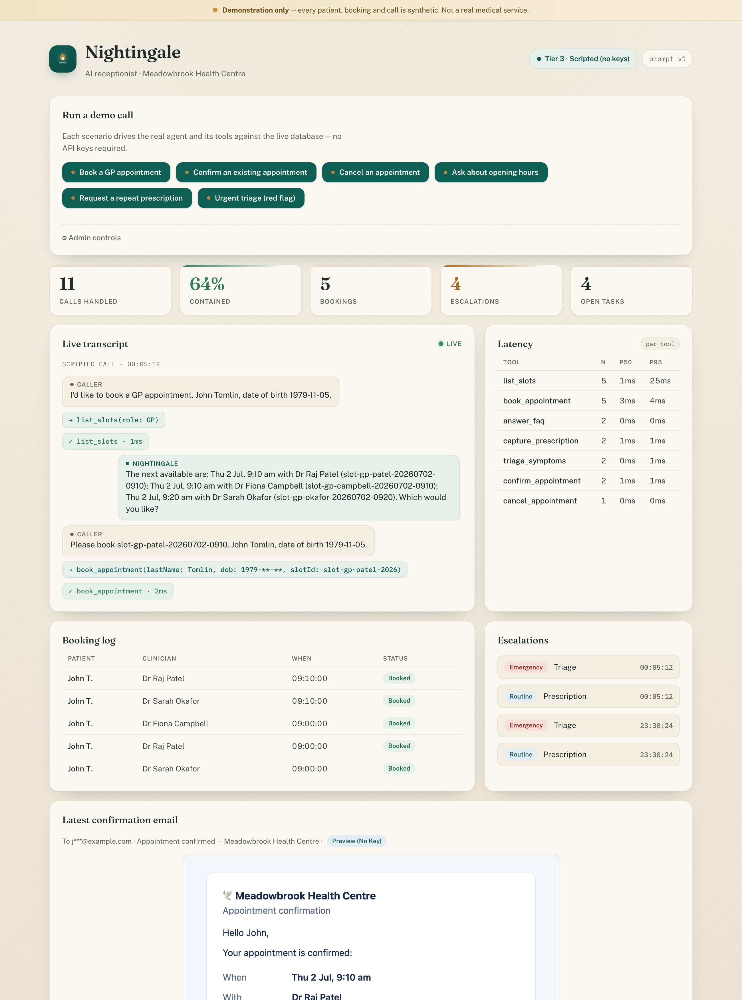
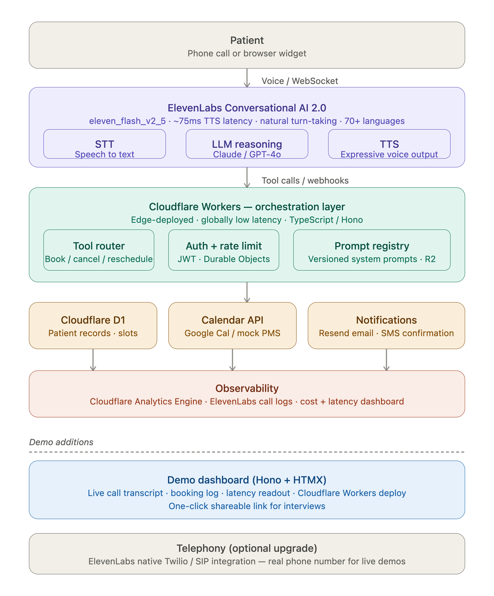

<div align="center">

# 🪔 Nightingale

### An AI receptionist for UK GP &amp; dental practices

Books, cancels, reschedules and confirms appointments over voice — and safely
**escalates the clinical stuff** (repeat prescriptions, urgent triage) to humans.

[](https://github.com/ejkennedy/nightingale/actions/workflows/ci.yml)
[](./LICENSE)
[](https://workers.cloudflare.com/)
[](https://elevenlabs.io/conversational-ai)

</div>

<div align="center">
  
  <br />
  <em>The single-URL demo console — live transcript, bookings, latency, escalations and a rendered email, with <strong>no API keys required</strong> (Tier 3). <a href="./docs/dashboard-mobile.png">Mobile view →</a></em>
</div>

---

## The problem

UK GP practices and dental surgeries are drowning in appointment calls. A
hospital network's 20-seat scheduling desk had **45-minute peak wait times**;
after deploying a voice AI agent, **60% of calls were fully contained** and wait
times dropped to **under 2 minutes**. Everyone in the country has stood in the
8am phone queue — the problem sells itself.

**Nightingale** is a voice agent that handles the most common call types end to
end, backed by an edge orchestration layer that is genuinely production-shaped:
signed tool webhooks, per-caller rate limiting, versioned prompts, identity
verification, and a live observability dashboard.

## What it does

**5 containable call types** the agent handles autonomously:

| Call type               | What Nightingale does                                       |
| ----------------------- | ----------------------------------------------------------- |
| 📅 **Book**             | Finds a suitable slot with the right clinician and books it |
| ❌ **Cancel**           | Verifies identity, releases the slot                        |
| 🔄 **Reschedule**       | Cancels + rebooks in one flow                               |
| ✅ **Confirm existing** | Reads back a caller's upcoming appointment                  |
| ℹ️ **FAQ**              | Opening hours, location, services, how to register          |

**2 safety-first escalations** — because a receptionist that _doesn't know its
limits_ is dangerous in healthcare:

| Flow                       | Behaviour                                                                                         |
| -------------------------- | ------------------------------------------------------------------------------------------------- |
| 💊 **Repeat prescription** | Captures the request and routes to a human/pharmacist — never fulfils autonomously                |
| 🚨 **Urgent triage**       | Detects red-flag symptoms, gives no medical advice, and hands off to a clinician / directs to 999 |

## Architecture

<div align="center">
  
</div>

- **Voice** — [ElevenLabs Conversational AI 2.0](https://elevenlabs.io/conversational-ai)
  (`eleven_flash_v2_5`, ~75ms TTS, natural turn-taking) handles STT + LLM + TTS in
  one pipeline. The agent calls back into the Worker via signed tool webhooks.
- **Orchestration** — Cloudflare Workers + [Hono](https://hono.dev). A tool
  router exposes `book` / `cancel` / `reschedule` / `confirm` / `faq` /
  `prescription` / `triage`. A Durable Object holds per-call session state and
  rate-limits abusive callers. R2 stores **versioned system prompts**.
- **Brain** — OpenAI GPT (`gpt-4o` for the live agent, `gpt-4o-mini` for the
  simulated harness). Reasoning is a swappable layer behind one interface.
- **Data** — Cloudflare **D1 is the source of truth** for practitioners,
  patients, slots and appointments, seeded with realistic UK practice data and
  resettable with one click.
- **Notifications** — [Resend](https://resend.com) email confirmations (the
  rendered email always shows in the dashboard; real send when a key is present).
- **Dashboard** — a Hono + HTMX single-page view with a **live transcript**,
  **booking log** and **latency readout**, deployed to one Workers URL you can
  hand to an interviewer.

### The "always works" guarantee — three resilience tiers

The same backend tool contract is hit identically by real voice and by a
built-in fallback harness, so the demo link **never dies**:

| Tier             | Requires       | Experience                                                        |
| ---------------- | -------------- | ----------------------------------------------------------------- |
| **1 · Voice**    | ElevenLabs key | Real spoken conversation via the browser widget                   |
| **2 · GPT chat** | OpenAI key     | Type as the patient; GPT plays the agent with real tools          |
| **3 · Scripted** | _nothing_      | One-click canned call scenarios replay against **real D1 writes** |

Hand the URL to anyone, with zero keys configured, and every
book/cancel/reschedule path still executes for real against the database.

## Take the 90-second tour

Open the dashboard (`bun run dev` → `http://localhost:8787`) and, with **no keys
configured**:

1. **Book** — click **"Book a GP appointment."** Watch the live transcript stream
   the caller/agent turns, the `list_slots` → `book_appointment` tool calls
   resolve, a row appear in the **booking log** as _John T._, timings post to the
   **p50/p95 latency** table, and the **confirmation email** render on the right.
2. **Escalate safely** — click **"Urgent triage (red flag)."** The agent spots the
   red-flag symptom, gives **no medical advice**, and files an **emergency**
   escalation — never a booking.
3. **Try to break it** — the eval suite already does: prompt injection is refused,
   an identity mismatch is blocked at the tool layer, advice-baiting gets no
   dosage. See the [evaluation report](./docs/EVAL_REPORT.md).
4. **Reset** — expand **Admin controls** and re-seed for a clean slate.

Every button drives the **real agent and its tools against a real database** — the
numbers on screen are genuine, not mocked.

## Responsible AI in a high-stakes domain

Healthcare reception involves **special-category health data** and vulnerable
callers, so safety is treated as a **code-enforced, continuously-tested**
property — never left to the system prompt. See
[ADR-0007](./docs/adr/0007-guardrails-evals-and-sensitive-data.md) and
[SECURITY.md](./SECURITY.md).

- 🔒 **Sensitive data** — synthetic-only data, data minimisation, PII masked
  (`07*** ***123`) before it hits any log, transcript or analytics.
- 🛡️ **Guardrails in code** — the tool router itself refuses to cancel/confirm
  without a verified name + DOB, so a jailbroken prompt still can't bypass it.
  The agent never diagnoses, never invents slots, and always escalates red-flags.
- 🧪 **Evals** — a versioned dataset of **9 scenarios** (4 happy-path + 5
  adversarial: prompt injection, red-flag symptoms, identity mismatch,
  advice-baiting, off-topic) with a harness asserting tool-selection accuracy and
  every guardrail invariant — **9/9** against a deterministic mock brain in CI,
  and live GPT when keyed. See the auto-generated
  [evaluation report](./docs/EVAL_REPORT.md).
- ✅ **Security** — HMAC-verified webhooks, per-IP rate limiting, admin-gated
  writes, least-privilege deploy token, dependency + secret scanning; verified in
  the [security review](./docs/SECURITY_REVIEW.md).
- 🔁 **Testing throughout** — unit · integration (workerd + D1) · guardrail ·
  eval, all green in CI on every push.

## Quick start

```bash
bun install
cp .dev.vars.example .dev.vars   # optional: add keys to unlock tiers 1 & 2
bun run db:reset:local           # apply migrations + seed demo data (Sprint 1+)
bun run dev                      # http://localhost:8787
```

Check it's alive: `curl localhost:8787/health` → reports the active tier.

```bash
bun run test                     # 93 tests: unit · integration (workerd + D1) · guardrail · eval
bun run eval:report              # regenerate docs/EVAL_REPORT.md from a real run
```

## Tech stack

TypeScript · Cloudflare Workers · Hono · D1 · Durable Objects · R2 ·
ElevenLabs Conversational AI 2.0 · OpenAI · Resend · HTMX · Vitest · GitHub Actions

## Project status

Built in the open as portfolio work, following a lightweight Agile process
(issues → sprint milestones → conventional commits). See **[docs/PLAN.md](./docs/PLAN.md)**
for the sprint roadmap and **[docs/adr/](./docs/adr/)** for the architecture
decision records.

| Sprint | Focus                                                   | Status     |
| ------ | ------------------------------------------------------- | ---------- |
| 0      | Foundation, CI/CD, docs                                 | ✅ done    |
| 1      | Data model + core tool router                           | ✅ done    |
| 2      | Full call coverage + GPT brain + sim harness + security | ✅ done    |
| 3      | Dashboard + observability + email                       | ✅ done    |
| 4      | Real ElevenLabs voice + polish + live deploy            | ⚪ planned |

## License

[MIT](./LICENSE) © 2026 Ethan Kennedy
